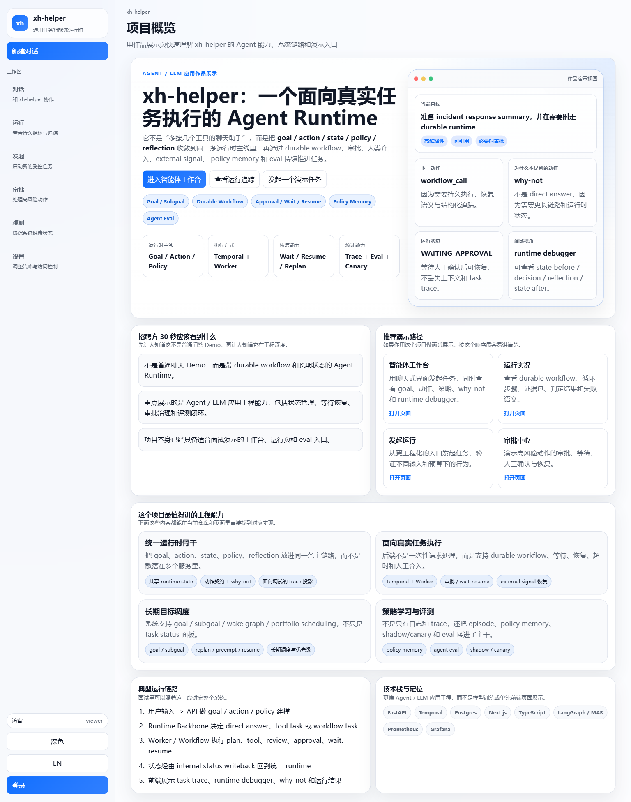
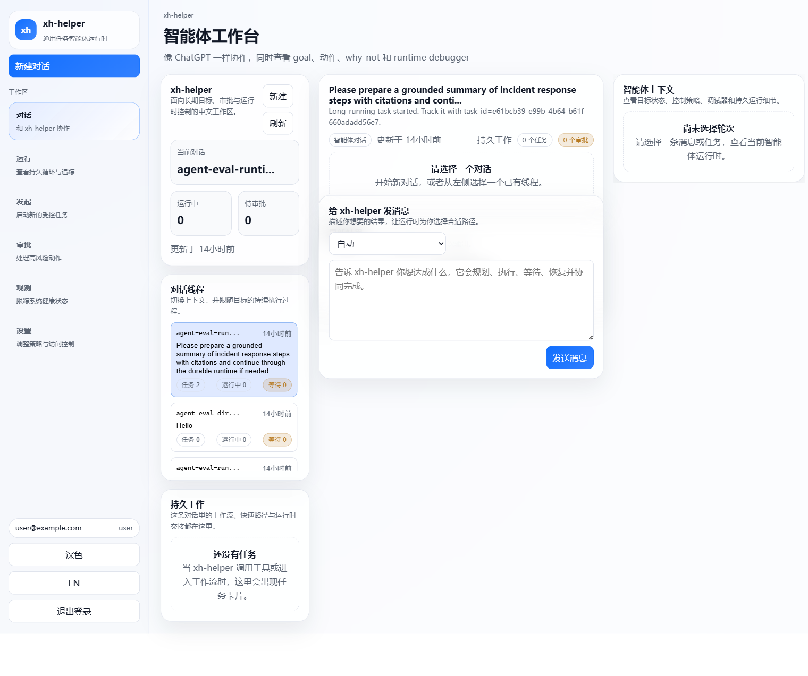
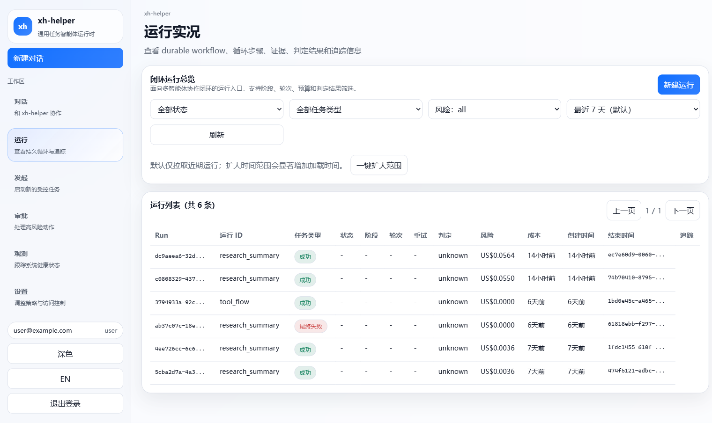
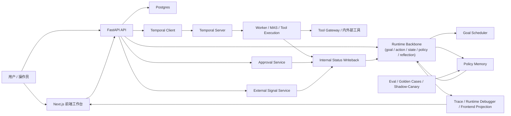

# xh-helper

## 1. 项目一句话介绍

`xh-helper` 是一个面向真实任务执行场景的 Agent Runtime / 通用任务智能体后端系统：它把用户请求收敛为 `goal / action / state / policy / reflection`，再通过 durable workflow、审批、人类介入、外部事件、策略记忆和评测闭环去推进任务，而不是停留在“会调几个工具的聊天机器人”层面。

## 项目截图

> 截图来自本地 Docker Compose 环境，主要用于展示项目作为求职作品时的实际界面形态。

### 作品展示首页



### 智能体工作台



### 运行实况页



---

## 2. 项目要解决的问题

很多 Agent 项目在演示时看起来很聪明，但工程上仍然只是“工具调用 demo”：

- 用户输入只被粗略分流成 route，无法稳定变成可以持续推进的目标
- workflow、工具、审批、人类介入、外部事件彼此割裂，状态一旦断层就很难恢复
- 失败时最多记录日志，缺少重规划、等待恢复、人工兜底等机制
- 历史经验更多用于展示，不会真正影响下一次策略选择
- 系统能跑出结果，但很难解释“为什么选了这个动作，而不是另一个”

`xh-helper` 的重点不是做一个“更会说话的助手”，而是把下面这些能力收敛到同一条运行主线里：

- 目标推进：把请求建模成可持续推进的 goal / subgoal
- 状态管理：让 assistant、worker、workflow、trace 共享同一份 runtime state
- 人类介入：把审批、等待、恢复、人工确认纳入主链路
- 故障恢复：面对 tool failure、subscription timeout、preempt、wait-resume 时能继续推进
- 评测闭环：用 eval、golden cases、shadow/canary 约束策略演化

---

## 3. 核心亮点

### 1) 统一 Runtime Backbone

项目把目标建模、动作选择、状态推进、反思恢复放在同一条骨干上，而不是散在 API、worker 和前端里。

- 核心入口集中在 [runtime_backbone/policy_engine.py](runtime_backbone/policy_engine.py)
- goal、policy memory、goal scheduler 分别落在：
  - [apps/api/app/services/goal_runtime_service.py](apps/api/app/services/goal_runtime_service.py)
  - [apps/api/app/services/policy_memory_service.py](apps/api/app/services/policy_memory_service.py)
  - [apps/api/app/services/goal_scheduler_service.py](apps/api/app/services/goal_scheduler_service.py)

工程价值：后续要做 wait/resume、approval、外部事件接入或策略演化时，不需要在多个模块里各写一套分支逻辑。

### 2) Durable Workflow，不是一次请求结束就算完成

系统使用 Temporal 承载任务生命周期，让任务能够等待、恢复、取消、超时、重试，而不是依赖单次 HTTP 请求。

- Workflow 定义在 [apps/worker/workflows.py](apps/worker/workflows.py)
- Temporal client 入口在 [apps/api/app/temporal_client.py](apps/api/app/temporal_client.py)
- API 服务入口在 [apps/api/app/main.py](apps/api/app/main.py)

工程价值：任务可以跨进程、跨时间持续推进，适合展示 Agent 应用里“长任务 / 真实执行”的后端能力。

### 3) Goal / Subgoal 调度，而不是只有 task status

项目不只维护任务状态，还维护长期 goal、subgoal、wake condition 和 portfolio 调度。

- 目标运行时状态在 [apps/api/app/services/goal_runtime_service.py](apps/api/app/services/goal_runtime_service.py)
- 调度逻辑在 [apps/api/app/services/goal_scheduler_service.py](apps/api/app/services/goal_scheduler_service.py)

具体体现：

- 支持 `goal / subgoal / wake graph`
- 支持 `wait / resume / replan / preempt`
- 支持等待审批、任务完成、用户补充消息、外部事件

工程价值：这让系统更像“持续推进目标”的后端，而不是一次性工作流执行器。

### 4) Policy Memory / Reflection / Eval 形成闭环

项目不仅记录 trace，还尝试让历史反馈和评测结果影响后续策略。

- 策略记忆与评估逻辑在 [apps/api/app/services/policy_memory_service.py](apps/api/app/services/policy_memory_service.py)
- 评测入口在 [eval/run_eval.py](eval/run_eval.py)
- Agent 级 golden cases 在 [eval/agent_golden_cases.yaml](eval/agent_golden_cases.yaml)

具体体现：

- episode / policy memory
- shadow / canary
- eval summary、candidate vs active 的比较

工程价值：项目不只是“能跑起来”，还在考虑如何验证、比较和改进智能体策略。

### 5) Approval / External Signal / Wait-Resume 在主链路内

审批、人类介入、外部环境变化都不是旁路逻辑，而是会回流为 observation 和 runtime state。

- 审批逻辑在 [apps/api/app/services/approval_service.py](apps/api/app/services/approval_service.py)
- 外部事件入口在 [apps/api/app/services/external_signal_service.py](apps/api/app/services/external_signal_service.py)
- 状态回写在 [apps/api/app/services/internal_service.py](apps/api/app/services/internal_service.py)

工程价值：适合展示“高风险动作受控执行”“等待外部结果后恢复”等真实企业场景能力。

### 6) 可解释、可调试，而不只是黑盒运行

项目不仅有执行结果，也尽量保留“为什么这样做”的解释线索。

- 前端工作台与运行页可查看 task trace、runtime debugger、why-not、动作契约
- 相关前端入口在：
  - [apps/frontend/app/assistant/page.tsx](apps/frontend/app/assistant/page.tsx)
  - [apps/frontend/app/runs/[id]/page.tsx](apps/frontend/app/runs/[id]/page.tsx)
  - [apps/frontend/lib/mas-types.ts](apps/frontend/lib/mas-types.ts)

工程价值：这很适合面试演示，也方便说明自己不仅会写 Agent 流程，还会考虑可观测性和调试体验。

---

## 4. 系统架构



### 一个典型请求是怎么流转的

1. 用户在前端发起请求，API 收到后先做 goal / action / policy 的初始建模  
2. Runtime Backbone 决定当前是直接回答、工具任务还是 durable workflow  
3. 如果需要持久执行，API 通过 Temporal 启动 workflow，worker 开始执行  
4. 执行过程中可能触发：
   - tool call
   - approval request
   - wait / resume
   - external signal
   - replan / reflect
5. 所有状态变化通过 internal status writeback 回写到统一 runtime state  
6. trace、runtime debugger、前端面板从这份状态中投影展示  
7. episode / eval / shadow / canary 再反过来影响后续策略

---

## 5. 仓库结构速览

第一次进入仓库，建议按下面的顺序看：

```text
apps/
  api/                         FastAPI 后端，负责任务入口、状态回写、审批、外部事件、对外 API
  worker/                      Temporal worker 与执行逻辑，包含 workflow、tool、MAS 集成
  frontend/                    Next.js 前端工作台，提供对话、运行追踪、调试面板

runtime_backbone/
  policy_engine.py             统一的运行时决策骨干，负责动作选择与状态推进

eval/
  run_eval.py                  评测入口，执行 golden cases 并输出评测结果
  agent_golden_cases.yaml      Agent 级行为测试样例
  golden_cases.yaml            常规任务样例
  policy_gate.py               策略评估与门控相关逻辑

docs/
  mas_architecture.md          MAS 相关设计说明
  task_lifecycle_state.md      任务生命周期说明
  campus_job_pitch.md          面向校招/实习的项目讲解稿

infra/
  postgres/                    数据库初始化脚本
  grafana/                     观测面板配置
  prometheus/                  指标采集与告警配置
  otel/                        OpenTelemetry 配置

scripts/
  demo_cli.py                  最小演示脚本
  verify_release.py            集成验证与回归验证脚本
  eval.py                      本地评测辅助入口

services/fake-internal-service/
  main.py                      仓库自带的假内部服务，用于本地联调和故障场景模拟
```

---

## 6. 已实现能力

下面只写当前仓库里可以落到代码和入口的真实能力。

### Runtime

- 统一动作与状态骨干  
  - [runtime_backbone/policy_engine.py](runtime_backbone/policy_engine.py)
- goal / subgoal / wake graph / portfolio 调度  
  - [apps/api/app/services/goal_runtime_service.py](apps/api/app/services/goal_runtime_service.py)
  - [apps/api/app/services/goal_scheduler_service.py](apps/api/app/services/goal_scheduler_service.py)
- 运行时状态回写与一致性维护  
  - [apps/api/app/services/internal_service.py](apps/api/app/services/internal_service.py)

### Workflow / Worker

- Temporal workflow 生命周期  
  - [apps/worker/workflows.py](apps/worker/workflows.py)
- worker 进程与活动注册  
  - [apps/worker/worker.py](apps/worker/worker.py)
- graph / MAS 执行能力  
  - [apps/worker/graph.py](apps/worker/graph.py)
  - [apps/worker/mas/langgraph_graph.py](apps/worker/mas/langgraph_graph.py)
  - [apps/worker/activities.py](apps/worker/activities.py)

### Policy Memory / Eval

- policy memory、长期反馈、shadow/canary  
  - [apps/api/app/services/policy_memory_service.py](apps/api/app/services/policy_memory_service.py)
- 评测入口与样例  
  - [eval/run_eval.py](eval/run_eval.py)
  - [eval/agent_golden_cases.yaml](eval/agent_golden_cases.yaml)
  - [eval/golden_cases.yaml](eval/golden_cases.yaml)

### Approval / External Signal

- 审批与审批信号调度  
  - [apps/api/app/services/approval_service.py](apps/api/app/services/approval_service.py)
- 外部事件接入与恢复  
  - [apps/api/app/services/external_signal_service.py](apps/api/app/services/external_signal_service.py)
- API 主入口与状态事件路由  
  - [apps/api/app/main.py](apps/api/app/main.py)

### Frontend / Debugging

- 对话式工作台  
  - [apps/frontend/app/assistant/page.tsx](apps/frontend/app/assistant/page.tsx)
- 运行详情与时间线  
  - [apps/frontend/app/runs/[id]/page.tsx](apps/frontend/app/runs/[id]/page.tsx)
  - [apps/frontend/components/agent-timeline.tsx](apps/frontend/components/agent-timeline.tsx)
- 运行时调试信息类型  
  - [apps/frontend/lib/mas-types.ts](apps/frontend/lib/mas-types.ts)

---

## 7. 快速开始

这一节优先基于仓库里的真实入口编写，默认推荐 Docker Compose 方式启动，因为它会同时拉起数据库、Temporal、fake internal service、API、worker、frontend 和观测组件。

### 环境要求

- Docker Desktop / Docker Compose
- Python 3.11+
- Node.js 20+

### 安装依赖

#### 方式 A：推荐，直接用 Docker Compose

项目已经提供完整的 `docker-compose.yml`，推荐直接用它启动主链路。

#### 方式 B：本地开发辅助

- 根目录测试依赖：`requirements.txt`、`requirements-dev.txt`
- API 依赖：`apps/api/requirements.txt`
- Worker 依赖：`apps/worker/requirements.txt`
- Frontend 依赖：`apps/frontend/package.json`

前端可以用：

```bash
cd apps/frontend
npm ci
```

### 配置 `.env`

仓库已经提供 `.env.example`：

```bash
cp .env.example .env
```

Windows 下如果没有 `cp`，可以手动复制一份 `.env.example` 为 `.env`。

至少需要确认这些变量：

- 数据库与 Temporal
  - `POSTGRES_USER`
  - `POSTGRES_PASSWORD`
  - `POSTGRES_DB`
  - `DATABASE_URL`
  - `TEMPORAL_TARGET`
  - `TEMPORAL_NAMESPACE`
  - `TEMPORAL_TASK_QUEUE`
- 鉴权与内部通信
  - `JWT_SECRET`
  - `INTERNAL_API_TOKEN`
  - `WORKER_AUTH_TOKENS`
  - `WORKER_AUTH_TOKEN`
  - `FAKE_INTERNAL_SERVICE_TOKEN`
- 前端
  - `NEXT_PUBLIC_API_BASE_URL`
- 种子账号
  - `SEED_OWNER_EMAIL`
  - `SEED_OWNER_PASSWORD`
  - `SEED_OPERATOR_EMAIL`
  - `SEED_OPERATOR_PASSWORD`
  - `SEED_USER_EMAIL`
  - `SEED_USER_PASSWORD`

如果你希望启用真实 Qwen / DashScope：

- `DASHSCOPE_API_KEY`
- `QWEN_MODEL`
- `QWEN_BASE_URL`
- `QWEN_TIMEOUT_S`

### 一键启动主链路

仓库里的 `Makefile` 已经提供主入口：

```bash
make up
make seed
```

对应动作分别是：

- `make up` -> `docker compose up -d --build`
- `make seed` -> `docker compose exec -T api python -m app.seed`

### 访问入口

启动后可以访问：

- 前端：[http://localhost:3000](http://localhost:3000)
- API 文档：[http://localhost:18000/docs](http://localhost:18000/docs)
- Temporal UI：[http://localhost:8088](http://localhost:8088)
- Prometheus：[http://localhost:9090](http://localhost:9090)
- Grafana：[http://localhost:3001](http://localhost:3001)

### 如果你想分开启动 API / worker / frontend

仓库里能确认到以下入口：

- API（来自 [apps/api/Dockerfile](apps/api/Dockerfile)）：

```bash
uvicorn app.main:app --host 0.0.0.0 --port 8000
```

建议在 `apps/api` 对应环境中运行，并设置合适的 `PYTHONPATH`。

- Worker（来自 [apps/worker/Dockerfile](apps/worker/Dockerfile) 和 [apps/worker/worker.py](apps/worker/worker.py)）：

```bash
python apps/worker/worker.py
```

- Frontend（来自 [apps/frontend/package.json](apps/frontend/package.json)）：

```bash
cd apps/frontend
npm run dev
```

> 说明：本地分开启动的完整依赖编排在仓库里没有像 Docker Compose 那样一键打包好，因此更推荐先走 Docker Compose 方式。如果你要做纯本地进程开发，请根据自己的 Python 环境、数据库和 Temporal 实例做相应调整。

### 最小运行步骤

如果你只想最快验证“它确实能跑”：

```bash
make up
make seed
```

然后：

1. 打开 [http://localhost:3000](http://localhost:3000)
2. 用 `.env` 里的 seed 账号登录
3. 进入 `/assistant` 发起一个请求
4. 进入 `/runs` 查看运行轨迹

---

## 8. 一个最小演示场景

下面这条路径适合面试时现场演示，也和当前仓库真实能力一致。

### 场景：发起一个需要持久执行和状态回写的任务

1. 在前端 `/assistant` 输入一个明确目标  
   例如：请准备一个带依据的 incident response summary，并在需要时继续走 durable runtime。

2. API 收到请求后做初始建模  
   Runtime Backbone 会把输入收敛成 `goal / current_action / policy / reflection`，而不是直接把请求分到某个固定路由。

3. 如果需要持久执行，启动 workflow  
   API 通过 Temporal 启动任务，worker 开始执行：
   - plan
   - tool / retrieval
   - review
   - approval / wait
   - replan / resume

4. 如果遇到等待点  
   系统可以进入：
   - 审批等待
   - 外部事件等待
   - 用户补充消息等待
   - 任务完成信号等待

5. 状态通过 internal status writeback 回到统一 runtime  
   前端可以看到：
   - 当前 goal
   - 当前动作
   - why-not
   - runtime debugger
   - task trace

6. 如果要演示最小 CLI 路径  
   仓库里已经有 [scripts/demo_cli.py](scripts/demo_cli.py)，可以用：

```bash
python scripts/demo_cli.py create
python scripts/demo_cli.py status --task-id <task_id>
python scripts/demo_cli.py approve --task-id <task_id>
```

这条链路适合你在面试里讲清楚：

- 请求不是直接变成一次工具调用
- 任务可以等待、恢复和继续推进
- 前端和后端都能解释系统为什么这么做

---

## 9. 评测与工程质量

这个项目的一个重点，不是“能跑起来”，而是“能不能验证它到底做得对不对”。

### Eval 的作用

- [eval/run_eval.py](eval/run_eval.py) 用来跑 golden cases
- [eval/agent_golden_cases.yaml](eval/agent_golden_cases.yaml) 用来覆盖 agent 主链路
- [eval/golden_cases.yaml](eval/golden_cases.yaml) 用来覆盖更基础的任务场景

你可以理解为：

- golden cases 负责定义“系统应该怎么表现”
- eval runner 负责把这些预期变成真正可执行的检查

### 仓库里的验证入口

- `make test`
  - API tests
  - worker tests
  - golden cases 格式校验
- `make eval-agent`
  - 跑 agent 级别的 eval cases
- `scripts/verify_release.py`
  - 做更完整的集成验证和结果汇总

### 工程质量线索

- API 有大量 pytest 用例，覆盖 approval、goal runtime、policy memory、external signal、eval validation 等
- worker 侧有 workflow、graph、MAS、retry、runtime policy 的测试
- frontend 有 vitest / playwright 相关脚本
- docker-compose 中已经包含 Prometheus、Grafana、OpenTelemetry 相关配置

这意味着项目考虑的不只是“把模型接上”，而是“如何把系统做成能观察、能验证、能迭代的工程”。

---

## 10. 适合简历怎么描述

### 如果你是招聘方，可以这样理解这个项目

- 这是一个偏 Agent / LLM 应用工程的项目，不是普通问答 Demo
- 它更强调长期任务控制、状态恢复、审批治理和调试解释
- 它展示的是把智能体系统工程化落地的能力，而不是模型训练能力

### 简历可提炼的能力点

- 独立搭建 FastAPI + Temporal + Postgres 的智能体执行后端
- 设计统一的 goal / action / state / policy 运行时骨干
- 支持审批等待、外部事件恢复、策略记忆和影子评测
- 能把前端工作台、后端执行链和评测闭环串成一个完整产品
- 对 Agent 应用的可观测性、可解释性和工程验证有实际落地经验

---

## 11. 已实现 vs 规划中

### 已实现

- 统一 Runtime Backbone
- Temporal durable workflow
- goal / subgoal / wake graph / portfolio scheduler
- approval / wait-resume / external signal
- policy memory / shadow / canary / eval runner
- 聊天式工作台、运行详情页、runtime debugger

### 规划中

- 更丰富的真实 external adapters 接入
- 更强的长期策略学习与 portfolio outcome learning
- 更完整的长期 memory conflict resolution / forgetting
- 更系统化的实验对比、灰度放量和自动回滚策略

这里刻意把“已实现”和“规划中”分开写，是为了避免把求职项目包装成“什么都做到了”的概念展示。当前仓库最值得展示的，是已经落地并可运行的工程骨干。
