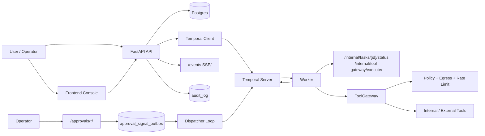

# XH Helper

XH Helper 是一个面向真实任务执行场景的智能体运行时项目。

这个仓库的目标，不是做一个“多接几个工具的聊天助手”，也不是把一堆 workflow 拼起来，而是把 assistant orchestration 逐步推进成一条统一的 runtime 主线：用户请求会先被解释成 `goal / action / state / policy`，然后由 durable workflow、worker、tool governance、approval、trace、memory、eval 一起推进和约束。

如果你更喜欢一句话版本：

> XH Helper 是一套“可治理、可恢复、可学习、可调试”的 agent runtime backend。

## 这个项目在解决什么问题

很多所谓“智能体”系统，真正的问题并不在模型，而在控制主干不成立：

- 用户请求只能被分流成 route，不能稳定变成可持续推进的 goal
- 工具调用、workflow、审批、人工接管彼此割裂，状态容易断层
- 失败只会写日志，不会进入反思、恢复和后续策略
- 历史经验更多用于展示，而不是实打实地改变下一次动作
- 系统能 demo 跑通，但很难解释“为什么走这条路径，而不是另一条”

XH Helper 的设计重点，就是把这些问题都收敛到同一个 runtime 里，而不是在 API、worker、trace、前端里各写一套逻辑。

## 目前系统长什么样

当前这套系统已经围绕同一个 runtime backbone 组织起来了：

- assistant 入口负责把用户请求收敛成 `goal / current_action / policy / reflection`
- worker 和 workflow 负责 durable 执行、审批等待、超时、取消、恢复和失败归类
- tool、workflow、MAS、approval、wait/resume 都进入同一条动作体系
- goal / subgoal / wake graph / portfolio scheduler 支持跨 task continuation、preempt、replan、resume
- episode、policy memory、shadow/canary eval 会反向影响后续动作选择
- trace 不只记录结果，还能看到 `state_before / observation / decision / reflection / state_after / why_not`

这意味着它已经不只是“增强助手”，而是一套比较完整的 agent runtime。

## 设计原则

- 一条主线：不再造第二套 runtime，assistant、workflow、worker、trace 共享同一条控制骨干
- 治理内建：审批、审计、出网控制、幂等、失败分类都属于 runtime，不是外挂逻辑
- 有界循环：允许反思、重规划、等待和恢复，但必须可解释、可停止、可调试
- 长期演化：经验、评测和影子策略要能稳定影响未来决策，而不是只写进日志
- 工程优先：先把 durable state、恢复语义、调试能力做好，再谈“更聪明”

## 核心能力

- 多智能体执行：worker 支持 LangGraph + MAS（含 closed-loop / gate / shadow 模式）
- Temporal 编排：`TaskWorkflow` 负责状态推进、审批等待、超时、取消与失败归类
- ToolGateway 治理：策略校验、出网限制、速率限制、运行上限、超时、幂等回放
- HITL 审批：审批决策写库与 signal outbox 同事务；异步 dispatcher 负责可靠投递
- Outbox 可靠性：`FOR UPDATE SKIP LOCKED` claim + 指数退避 + 失败终态观测
- 幂等与审计：`client_request_id`、`status_event_id`、`tool_call_id` 多层幂等；关键路径审计日志
- 经验与评测闭环：episode retrieval、policy memory、shadow/canary、agent-grade eval

## 架构图



## 关键机制和代码入口

1. Temporal workflow 生命周期
- `apps/api/app/temporal_client.py`
- `start_task_workflow(...)`
- `signal_approval(...)`
- `cancel_workflow(...)`

2. 内部状态回写护栏
- `apps/api/app/services/internal_service.py`
- `update_internal_task_status(...)`

3. 状态机定义
- `apps/api/app/state_machine.py`
- `FINAL_STATES`
- `ALLOWED_TRANSITIONS`
- `is_valid_transition(current_status, next_status)`

4. 审批与 Outbox 可靠投递
- `apps/api/app/services/approval_service.py`
- `apps/api/app/repositories.py`

5. ToolGateway 治理入口
- `apps/api/app/tool_gateway.py`
- `ToolGateway.execute(...)`
- `_dispatch(...)`
- `_enforce_egress(...)`
- `_idempotent_replay(...)`
- `_deny(...)`

6. 统一 runtime / policy backbone
- `runtime_backbone/policy_engine.py`
- `apps/api/app/services/goal_runtime_service.py`
- `apps/api/app/services/policy_memory_service.py`
- `apps/api/app/services/goal_scheduler_service.py`

7. 失败分类
- `apps/worker/failure_classification.py`
- `classify_failure_status(exc)`

## Quickstart

### 0) 前置要求

- Docker + Docker Compose
- Python 3.11+
- GNU Make（可选）

### 1) 配置环境变量

```bash
cp .env.example .env
```

`.env.example` 仅用于本地开发。不要把真实密钥、令牌、密码提交到仓库。

如果你要启用真实 Qwen 模型，请在 `.env` 里补这些变量：

```bash
DASHSCOPE_API_KEY=<your-key>
QWEN_MODEL=qwen-plus
QWEN_BASE_URL=https://dashscope.aliyuncs.com/compatible-mode/v1
QWEN_TIMEOUT_S=60
```

当前接入方式使用阿里云 DashScope 的 OpenAI-compatible Chat Completions 接口。

### 2) 一键启动

```bash
docker compose up -d --build
```

启动后常用地址：

- API 文档：`http://localhost:18000/docs`
- Temporal UI：`http://localhost:8088`
- Frontend：`http://localhost:3000`
- Prometheus：`http://localhost:9090`
- Grafana：`http://localhost:3001`

### 3) 初始化默认账号

```bash
docker compose exec -T api python -m app.seed
```

默认账号来自 `.env`：

- Owner：`${SEED_OWNER_EMAIL}`
- Operator：`${SEED_OPERATOR_EMAIL}`
- User：`${SEED_USER_EMAIL}`

## Demo

### Make 方式

```bash
make demo-create
# 输出包含 TASK_ID / RUN_ID

make demo-status TASK_ID=<task_id>

# 若是 ticket_email 任务，存在 WAITING_HUMAN 审批时：
make demo-approve TASK_ID=<task_id>
# 或指定 approval_id
make demo-approve APPROVAL_ID=<approval_id>
```

### curl 方式

```bash
# 1) 登录拿 token
curl -s -X POST "http://localhost:18000/auth/login" \
  -H "Content-Type: application/json" \
  -d '{"email":"user@example.com","password":"ChangeMe123!"}'

# 2) 创建任务
curl -s -X POST "http://localhost:18000/tasks" \
  -H "Authorization: Bearer <ACCESS_TOKEN>" \
  -H "X-Tenant-Id: default" \
  -H "Content-Type: application/json" \
  -d '{
    "client_request_id":"demo-001",
    "task_type":"ticket_email",
    "input":{"content":"incident: api 500","target":"ops@example.com"},
    "budget":1.0
  }'

# 3) 查看任务详情（task/runs/steps/approvals/tool_calls）
curl -s "http://localhost:18000/tasks/<TASK_ID>" \
  -H "Authorization: Bearer <ACCESS_TOKEN>" \
  -H "X-Tenant-Id: default"
```

## 开发与验证

常规回归：

```bash
python scripts/test.py -q
python scripts/eval.py --base-url http://localhost:18000 --cases eval/golden_cases.yaml
```

Agent-grade 最终验收：

```bash
python eval/check_cases_yaml.py eval/agent_golden_cases.yaml
make eval-agent
```

等价命令：

```bash
docker compose exec -T api python /workspace/eval/run_eval.py --base-url http://api:8000 --cases /workspace/eval/agent_golden_cases.yaml
```

浏览器自动化验证（Playwright）：

```bash
cd apps/frontend
npm run test:e2e
```

详细步骤见 `docs/testing/browser-e2e.md`。

## Qwen 接入说明

- 配置 `DASHSCOPE_API_KEY` 后，assistant 的直接回答会优先走 Qwen，失败时回退到现有规则/检索回复
- assistant planner 会以现有规则计划为基线，再用 Qwen 做轻量补强；审批/强制 mode 仍以现有治理规则为准
- worker 的 `plan_activity` 会优先尝试 `QWEN_MODEL`，失败时回退到现有 `mock-primary/mock-backup` 规划链路
- worker 的 `review_activity` 会优先用 Qwen 生成最终用户可见结果；若有人审编辑输出，则优先保留人工编辑结果

## 已知限制

- 当前以单机 Docker Compose 为主，未提供生产级 HA 部署模板
- tool adapter 以示例实现为主（`internal_rest_api` / `web_search` / `email_ticketing` 等），生产适配器需按业务扩展
- 审批 dispatcher 为进程内循环，跨实例协调依赖数据库锁语义与部署策略
- 前端能力目前聚焦演示与调试，生产环境建议接入企业 SSO / 网关层会话方案

## 审计文档

- `docs/audit/architecture.md`
- `docs/audit/state-machine.md`
- `docs/audit/approval-outbox.md`
- `docs/audit/tool-gateway-governance.md`
- `docs/RELEASE_NOTES_v0.1.0.md`

## 安全提醒

- 严禁提交真实 `.env`、私钥、token、生产密码
- 内部调用令牌（`INTERNAL_API_TOKEN` / `WORKER_AUTH_TOKEN`）必须在部署环境通过密钥管理系统注入
- 审计日志仅写 masked / summarized 内容，避免写入敏感原文
- 详细安全策略见 `docs/SECURITY.md`

## License

本项目以 MIT License 开源（见 `LICENSE`）。
