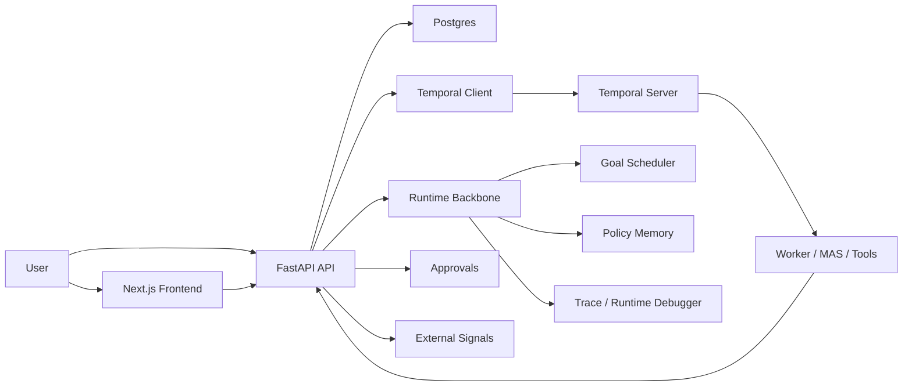

# xh-helper

`xh-helper` 是一个面向真实任务执行场景的 Agent Runtime 项目。  
它不是“多接几个工具的聊天助手”，而是把 `goal / action / state / policy / reflection` 收敛到同一条运行时主线上，再用 durable workflow、审批治理、外部事件、策略记忆和评测闭环去推进任务。

如果你是招聘方，可以把它理解成：

- 一个更接近 **Agent / LLM 应用工程** 的项目，而不是普通的问答 Demo
- 一个强调 **可恢复、可治理、可解释、可评测** 的智能体运行时
- 一个适合展示 **后端架构能力 + Agent 产品化能力 + 前端调试体验** 的求职作品

## 这个项目解决什么问题

很多所谓“智能体”项目，核心问题并不在模型，而在控制主干：

- 用户请求只被分成 route，无法稳定变成可持续推进的 goal
- 工具调用、workflow、审批、人类接管和 trace 相互割裂
- 失败只会记日志，不会进入反思、恢复和后续策略调整
- 历史经验更多用于展示，而不是实打实影响下次决策
- 系统能跑 Demo，但很难解释“为什么走这条路径，而不是另一条”

`xh-helper` 的重点，就是把这些能力都收敛到同一个 runtime 里，而不是在 API、worker、trace、前端里各写一套逻辑。

## 招聘方最容易看懂的亮点

### 1. 不是“增强助手”，而是 Agent Runtime

- assistant 请求会先被收敛成 `goal / current_action / policy / reflection`
- worker 和 workflow 负责 durable 执行、审批等待、超时、取消、失败分类和恢复
- tool、workflow、approval、wait/resume、external signal 都进入同一套动作体系

### 2. 有长期目标控制，而不是单轮问答

- 支持 `goal / subgoal / wake graph / portfolio scheduler`
- 支持跨 task continuation、preempt、replan、resume
- 可以等待审批、外部事件、用户补充消息、任务完成信号

### 3. 有策略学习闭环，而不是“只会调工具”

- 支持 episode retrieval、policy memory、shadow / canary
- external wait、subscription timeout、goal starvation、portfolio throughput 会进入长期学习
- agent-grade eval 会约束策略是否晋升或回滚

### 4. 前端可解释、可调试

- 聊天式工作台支持查看 goal、策略、当前动作、why-not、runtime debugger
- 运行页支持查看 durable workflow、时间线、证据、失败语义和追踪
- 适合面试时做“边演示边解释”的展示

## 当前已经实现的核心能力

### 统一的 Runtime Backbone

- `runtime_backbone/policy_engine.py`
- `apps/api/app/services/goal_runtime_service.py`
- `apps/api/app/services/policy_memory_service.py`
- `apps/api/app/services/goal_scheduler_service.py`

这条主线负责把目标建模、动作选择、状态推进、反思恢复和长期调度收敛到一起。

### Durable Workflow + Worker 执行

- `apps/worker/workflows.py`
- `apps/api/app/temporal_client.py`
- `apps/api/app/main.py`

后端使用 FastAPI + Temporal + Postgres 组织执行链路，支持 durable task、审批等待、状态回写、取消、重试和超时。

### Policy Memory / Shadow / Canary / Eval

- `apps/api/app/services/policy_memory_service.py`
- `eval/run_eval.py`
- `eval/agent_golden_cases.yaml`

仓库里已经有 agent 级别的 golden cases 和 eval runner，不只是单元测试。

### External Observation / Approval / Wait-Resume

- `apps/api/app/services/external_signal_service.py`
- `apps/api/app/services/approval_service.py`
- `apps/api/app/services/internal_service.py`

系统可以等待审批、外部事件、任务完成、用户补充消息，再按统一 runtime 语义恢复。

## 架构概览



## 技术栈

- 后端：FastAPI、Temporal、Postgres、Pydantic
- Worker：Python、LangGraph / MAS、Tool Gateway
- 前端：Next.js、TypeScript
- 观测：Prometheus、Grafana、OpenTelemetry
- 运行方式：Docker Compose

## 本地运行

### 1. 准备环境

```bash
cp .env.example .env
```

然后准备：

- Docker Desktop / Docker Compose
- Python 3.11+
- Node.js 20+

### 2. 启动服务

```bash
make up
make seed
```

### 3. 打开页面

- 前端：[http://localhost:3000](http://localhost:3000)
- API 文档：[http://localhost:18000/docs](http://localhost:18000/docs)
- Temporal UI：[http://localhost:8088](http://localhost:8088)
- Prometheus：[http://localhost:9090](http://localhost:9090)
- Grafana：[http://localhost:3001](http://localhost:3001)

## 建议演示路径

如果你是拿它做面试展示，建议顺序是：

1. 打开 `/` 首页，先让面试官知道这是一个 Agent Runtime 项目
2. 打开 `/assistant`，演示聊天式工作台和 runtime debugger
3. 打开 `/runs`，展示 durable workflow、trace、证据和失败恢复
4. 如果时间够，再展示 `/approvals` 和 external signal 驱动的恢复链路

## 如何做 Agent 级验证

### 运行常规回归

```bash
make test
```

### 运行 Agent Eval

```bash
make eval-agent
```

这里会使用：

- `eval/run_eval.py`
- `eval/agent_golden_cases.yaml`

去验证 assistant / runtime / trace / runtime debugger 这些主链路能力。

## 适合写进简历的项目定位

适合投递这些方向：

- Agent / LLM 应用开发
- AI Agent 后端 / 平台工程
- 智能体工作流 / runtime / orchestration 工程
- AI 产品工程 / 全栈方向实习或校招

如果你想直接写简历或准备面试说明，可以看：

- [docs/campus_job_pitch.md](docs/campus_job_pitch.md)

## 诚实边界

这个项目已经具备通用智能体运行时的主干能力，但我不会把它包装成“无所不能的 AGI”。

更准确地说，它是一套：

- 强调长期控制和恢复语义的 Agent Runtime
- 强调工程治理、调试和评测的 LLM 应用系统
- 适合展示 Agent 工程能力，而不是展示模型训练能力的项目

这也是它最适合用于求职作品集的地方。
